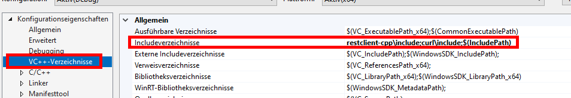
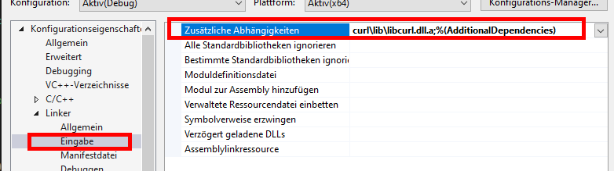

# CPP

Für cpp wurde Visual Studio verwendet, da dieser den Compiler bereits installiert hat. 

Es wird eine Konsolen-App C++ verwendet für dieses Beispiel.

Es wurde die aktuelle Version von CURL heruntergeladen und im Projektordner abgelegt. 

[curl - Download](https://curl.se/download.html)

Ebenfalls wurde der Restclient-cpp heruntergeladen und im Projektordner abgelegt.

[GitHub - mrtazz/restclient-cpp: C++ client for making HTTP/REST requests](https://github.com/mrtazz/restclient-cpp)

In den Projekteigenschaften müssen folgende Werte angepasst werden (Fett geschrieben):

In den Projekteigenschaften muss man be `VC++-Verzeichnisse` -> `Includeverzeichnisse` die Werte `restclient-cpp\include` und `curl\include` hinzugefügt werden.



Und bei Abschnitt `Linker` -> `Eingabe` muss `curl\lib\libcurl.ddl.a;%AdditionalDependencies)` angegeben werden.



Die Datei <Projektordner>\curl\bin\libcurl-x64.dll muss in den Debug-Ordner kopiert werden:


## Vorbereitung

Includes und using Keywörter definieren

```cpp
#include "restclient-cpp/connection.h"
#include "restclient-cpp/restclient.h"
#include <iostream>

#include "nlohmann/json.hpp"

#include "Struct_API.h"
#include "ConsoleApplication1.h"

using json = nlohmann::json;
using namespace std;
```

In der Main-Funktion muss man folgende Schritte noch ausführen:

```cpp
// initialize RestClient
RestClient::init();

//get a connection object
RestClient::Connection* conn = new RestClient::Connection("http://127.0.0.1:9020");

//set connection timeout to 5s
conn->SetTimeout(5);

// set custom user agent
// (this will result in the UA "foo/cool restclient-cpp/VERSION")
conn->SetUserAgent("Test");

// set headers
// conn->AppendHeader("Accept", "application/json");
conn->AppendHeader("Content-Type", "application/json");
```

Die Connection muss man entsprechend den Anforderungen anpassen.

## Set

Man kann den Set-Befehl im Json angeben und als String in den Post-Befehl einfügen. Dies kann so aussehen:

```cpp
// Set
json j_Set;

// Json
j_Set["whois"] = "cpp_test_client";
j_Set["user"] = "";
j_Set["set"] = { {
    {"path", "Test:Datenelement"}, 
    {"value", "Inhalt"}, 
    {"create", true},
    {"CreateDefault", false}
} };

// Post
string s_set = j_Set.dump();
RestClient::Response responseSet = conn->post("/json_data", s_set); 
```

Rückgabe:

```json
{
    "whois": "golang_test_client",
    "set": [
        {
            "path": "Test:Datenelement",
            "code": "ok",
            "type": "string",
            "value": "Inhalt",
            "stamp": "2022-10-03T14:14:38,392+02:00"
        }
    ]
}
```

Die einzelnen Werte der Rückgabe kann man folgendermassen machen.

```cpp
// Output response
json j_set_response = json::parse(responseSet.body);
std::cout << j_set_response["set"][0]["value"] << endl;
```

Im Terminal wird nun folgendes ausgegeben:

```shell
Inhalt
```

# Get

Man kann den Get-Befehl im Json angeben und als String in den Post-Befehl einfügen. Dies kann so aussehen:

```cpp
// Get
json j_get;

// Json
j_get["get"] = { {
    {"path", "Test"},
    {"query", {
        {"regExPath", "^(Test).*$"},
        {"maxDepth", 0}
    }}
} };

// Post
string s_get = j_get.dump();
RestClient::Response responseGet = conn->post("/json_data", s_get);
```

Rückgabe:

```json
{
    "get": [
        {
            "code": "ok",
            "path": "Test",
            "type": "none",
            "value": null,
            "stamp": null,
            "hasChild": true
        },
        {
            "code": "ok",
            "path": "Test:Datenelement",
            "type": "string",
            "value": "Inhalt",
            "stamp": "2022-11-25T12:39:06,046+01:00"
        }
    ]
}
```

Man die Werte von mehreren Rückgaben ausgeben mit einer for-Iteration:

```cpp
// Output response
json j_get_response = json::parse(responseGet.body);

for (size_t i = 0; i < j_get_response["get"].size(); i++)
{
    std::cout << "Path: " << j_get_response["get"][i]["path"] << endl;
    std::cout << "Value: " << j_get_response["get"][i]["value"] << endl;
    std::cout << "------------------------------" << endl;
}
```

Im Terminal wird nun folgendes ausgegeben:

```shell
Path: "Test"
Value: null
------------------------------
Path: "Test:Datenelement"
Value: "Inhalt"
------------------------------
```

# Rename

Man kann den Rename-Befehl im Json angeben und als String in den Post-Befehl einfügen. Dies kann so aussehen:

```cpp
// Rename
json j_rename;

// Json
j_rename["whois"] = "cpp_test_client";
j_rename["rename"] = { {
    {"path", "Test:Datenelement"},
    {"newPath", "Test:Umbenannt"}
} };

// Post
string s_rename = j_rename.dump();
RestClient::Response responseRename = conn->post("/json_data", s_rename);
```

Rückgabe:

```json
{
    "whois": "cpp_test_client",
    "rename": [
        {
            "path": "Test:Datenelement",
            "newPath": "Test:Umbenannt",
            "code": "error",
            "message": "Could not rename"
        }
    ]
}
```

Man kann den Code auslesen um zu kontrollieren ob das Datenelement erfolgreich umbenannt wurde:

```cpp
std::cout << "Code: " << j_rename_response["rename"][0]["code"] << endl;
```

Im Terminal wird nun folgendes angegeben:

```shell
Code: "ok"
```

# Copy

Man kann den Copy-Befehl im Json angeben und als String in den Post-Befehl einfügen. Dies kann so aussehen:

```cpp
// Copy
json j_copy;

j_copy["whois"] = "cpp_test_client";
j_copy["copy"] = { {
    {"path", "Test:Umbenannt"},
    {"destPath", "Test:Kopiert"}
} };

// Post
string s_copy = j_copy.dump();
RestClient::Response responseCopy = conn->post("/json_data", s_copy);
```

Rückgabe:

```json
{
    "whois": "cpp_test_client",
    "copy": [
        {
            "path": "Test:Umbenannt",
            "destPath": "Test:Kopiert",
            "code": "ok"
        }

    ]
}
```

Man kann den Pfad vom neuen Datenelement auslesen:

```cpp
// Output response
json j_copy_response = json::parse(responseCopy.body);

std::cout << "Neues Datenelement: " << j_copy_response["copy"][0]["destPath"] << endl;
```

Im Terminal wird nun folgendes angegeben:

```shell
Neues Datenelement: "Test:Kopiert"
```

# Delete

Man kann den Delete-Befehl im Json angeben und als String in den Post-Befehl einfügen. Dies kann so aussehen:

```cpp
// Delete
json j_delete;

j_delete["whois"] = "cpp_test_client";
j_delete["delete"] = { {
    {"path", "Test:Kopiert"},
} };

// Post
string s_delete = j_delete.dump();
RestClient::Response responseDelete = conn->post("/json_data", s_delete);
```

Rückgabe:

```json
{
    "whois": "cpp_test_client",
    "delete": [
        {
            "path": "Test:Kopiert",
            "code": "ok"
        }
    ]
}
```

Man kann den Code auslesen um zu kontrollieren das Datenelement erfolgreich gelöscht wurde:

```cpp
// Output response
json j_delete_response = json::parse(responseDelete.body);

std::cout << "Code: " << j_delete_response["delete"][0]["code"] << endl;
```

Im Terminal wird nun folgendes angegeben:

```shell
Code: "ok"
```

# Tipps und Tricks

Wenn eine Ausführung nicht erfolgreich war, sieht man dies indem der Code nicht “ok” ausgibt, sondern einen anderen Wert. (z.B. “not found”)

```json
{
    "whois": "test_client",
    "delete": [
        {
            "path": "Test:NewValue",
            "code": "not found",
            "message": "Data point doesn't exist"
        }
    ]
}
```

Diese kann man abfragen und anzeigen, damit man immer Feedback hat, ob die Anfrage erfolgreich ausgeführt worden ist.

```cpp
// Output response
json j_delete_response2 = json::parse(responseDelete2.body);

if (j_delete_response2["delete"][0]["code"] != "ok") {
    std::cout << "Fehler bei der Ausführung 'delete'" << endl;
    std::cout << j_delete_response2["delete"][0]["message"] << endl;
}
```

Wenn nun die Anfrage nicht ok ist, kann folgende Meldung im Terminal angezeigt werden:

```shell

```
