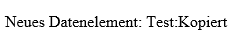

# Javascript

Um den Verlauf im Browser anzuzeigen, muss man den Google Chrome Browser im `disable security` öffnen ([Anleitung](https://support.hcltechsw.com/csm?id=kb_article&sysparm_article=KB0088655)).

## Vorbereitung

Es muss ein Projektordner erstellt werden und in diesem müssen die Datei js_api.js kopiert werden. Erstelle ein neues Dokument mit dem Namen js_api.html.

In der Datei muss folgendes eingegeben werden:

```html
<!DOCTYPE html>
<html>
  <body>
    <h1>REST API Anwendung Javascript</h1>

    <script src="./js_api.js"></script>

    <script>
      const HOST = "127.0.0.1"
      const PORT = "9020"
      const PROTOCOL = "HTTP"
      const ENDPOINT = "json_data"
      const WHOIS = "js_test_client"
      const USER = ""
    </script>
  </body>
</html>
```

### function dp_set

```js
function dp_set(host, port, protocol, body)
```

Den Body kann man mit Json erstellen. Dies kann im js_api.html so aussehen:

```js
body_set = {
  "path": "Test:Datenelement",
  "value": "Inhalt",
  "create": true
}

dp_set(HOST, PORT, PROTOCOL, ENDPOINT, body_set)
``` 

Die Rückgabe von dp_set_rsp_txt:

```json
{
	"whois": "php_test_client",
    "set": [
        {
            "path": "Test:Datenelement",
            "code": "ok",
            "type": "string",
            "value": "Inhalt",
            "stamp": "2022-10-07T10:20:35,419+02:00"
        }
    ]
}
```

Die einzelnen Werte der Rückgabe kann man folgendermassen anzeigen:

```js
function dp_set_rsp(response) {
  let text = response
  const obj_set = JSON.parse(text)
  document.getElementById("dp_set_rsp_text").innerHTML = "Erstelltes Datenelement Value: " + obj_set.set[0].value
}
```

```html
  <p id="dp_set_rsp_text"></p>
```

Im Browser wird beim neuladen folgendes angezeigt:


### function dp_get

```js
function dp_get(host, port, tag, protocol, endpoint, body)
```

Den Body kann man mit Json erstellen. Dies kann im js_api.html so aussehen:

```js
body_get = {
  "path": "",
  "query": {
	"regExPath": "Test.*",
	"maxDepth": "0"
  }
}

dp_get(HOST, PORT, "", PROTOCOL, ENDPOINT, body_get)
```

Die Rückgabe von dp_get_rsp_text:

```json
{
    "tag": "",
    "get": [
        {
            "code": "ok",
            "path": "Test",
            "type": "none",
            "value": null,
            "stamp": null,
            "hasChild": true
        },
        {
            "code": "ok",
            "path": "Test:Datenelement",
            "type": "string",
            "value": "Inhalt",
            "stamp": "2022-10-07T10:36:59,006+02:00"
        }
    ]
}
```

Man kann die Werte von mehreren Rückgaben ausgeben mit einer for-Iteration:

```js
function dp_get_rsp(response) {
  let text = response
  const obj_get = JSON.parse(text)

  var str_get = ""
  for (var i = 0; i < obj_get.get.length; i++) {
	str_get += "Path: " + obj_get.get[i].path + "<br>"
	str_get += "Value: " + obj_get.get[i].value + "<br>"
	str_get += "------------------------------<br>"
  }

  document.getElementById("dp_get_rsp_text").innerHTML = str_get;
}
```

```html
<p id="dp_get_rsp_text"></p>
```

Im Browser wird beim neuladen folgendes angezeigt:


### function dp_get zusätzliches Beispiel

Man kann auch direkt einen Pfad angeben. Dies kann im js_api.html so aussehen:

```js
body_get2 = {
  "path": "System:Date:DateLong"
}

dp_get2(HOST, PORT, "", PROTOCOL, ENDPOINT, body_get2);
```

Mögliche Rückgabe:
```json
{
  "tag": "",
  "get": [
    {
      "path": "System:Date:DateLong",
      "code": "ok",
      "type": "string",
      "value": "08.03.2023",
      "stamp": "2023-03-08T07:07:19,925+01:00"
    }
  ]
}
```

### function dp_rename

```js
function dp_rename(host, port, protocol, endpoint, body)
```

Den Body kann man mit Json erstellen. Dies kann im js_api.html so aussehen:

```js
body_rename = {
  "path": "Test:Datenelement",
  "newPath": "Test:Umbenannt"
}

dp_rename(HOST, PORT, PROTOCOL, ENDPOINT, body_rename)
```

Die Rückgabe von dp_rename_rsp_txt:

```json
{
    "whois": "php_test_client",
    "rename": [
        {
            "path": "Test:Datenelement",
            "newPath": "Test:Umbenannt",
            "code": "ok"
        }
    ]
}
```

Man kann den Code auslesen um zu kontrollieren ob das Datenelement erfolgrech umbenannt wurde:

```js
function dp_rename_rsp(response) {
  let text = response
  const obj_rename = JSON.parse(text)

  document.getElementById("dp_rename_rsp_txt").innerHTML = "Code: " + obj_rename.rename[0].code
}
```

```html
<p id="dp_rename_rsp_txt"></p>
```

Im Browser wird beim neuladen folgendes angezeigt:


### function dp_copy

```js
function dp_copy(host, port, protocol, endpoint, body)
```

Den Body kann man mit Json erstellen. Dies kann im js_api.html so aussehen:

```js
body_copy = {
  "path": "Test:Umbenannt",
  "destPath": "Test:Kopiert"
}

dp_copy(HOST, PORT, PROTOCOL, ENDPOINT, body_copy)
``` 

Die Rückgabe von dp_copy_rsp_txt:

```json
{
    "whois": "php_test_client",
    "copy": [
        {
            "path": "Test:Umbenannt",
            "destPath": "Test:Kopiert",
            "code": "ok"
        }
    ]
}
```

Man kann den Pfad vom neuen Datenelement auslesen:

```js
function dp_copy_rsp(response) {
  let text = response
  const obj_copy = JSON.parse(text)

  document.getElementById("dp_copy_rsp_txt").innerHTML = "Neues Datenelement: " + obj_copy.copy[0].destPath
}
```

```html
<p id="dp_copy_rsp_txt"></p>
```

Im Browser wird beim neuladen folgendes angezeigt:



### function dp_delete

```js
function dp_delete(host, port, protocol, endpoint, body)
```

Den Body kann man mit Json erstellen. Dies kann im js_api.html so aussehen:

```js
body_delete = {
  "path": "Test:Kopiert"
}

dp_delete(HOST, PORT, PROTOCOL, ENDPOINT, body_delete)
```

Die Rückgabe von dp_delete_rsp_txt:

```json
{
    "whois": "php_test_client",
    "delete": [
        {
            "path": "Test:Kopiert",
            "code": "ok"
        }
    ]
}
```

Man kann den Code auslesen um zu kontrollieren dass das Datenelement erfolgreich gelöscht wurde:

```js
    function dp_delete_rsp(response) {
  let text = response
  const obj_delete = JSON.parse(text)

  document.getElementById("dp_delete_rsp_txt").innerHTML = "Code: " + obj_delete.delete[0].code
}
```

```html
<p id="dp_delete_rsp_txt"></p>
```

Im Browser wird beim neuladen folgendes angezeigt:


